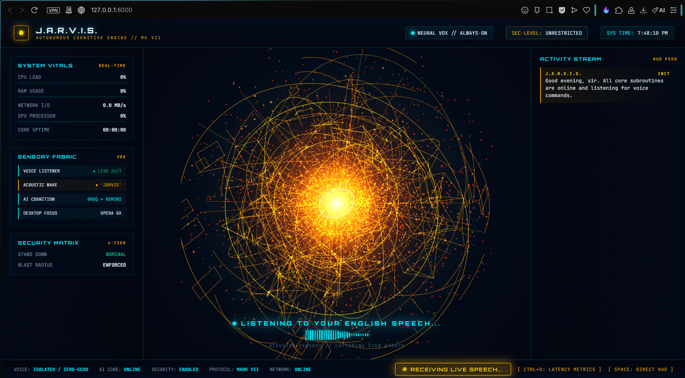
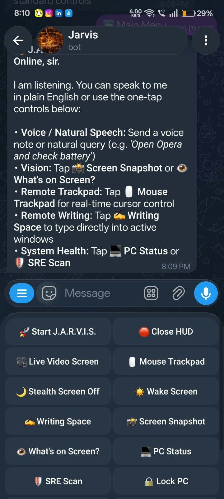
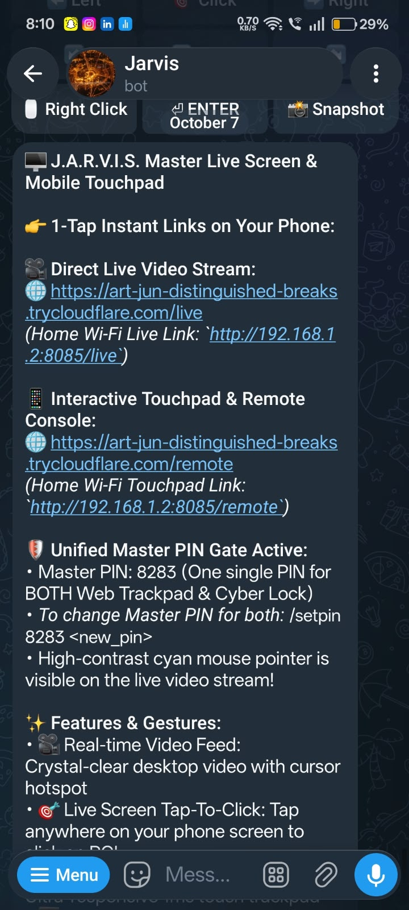
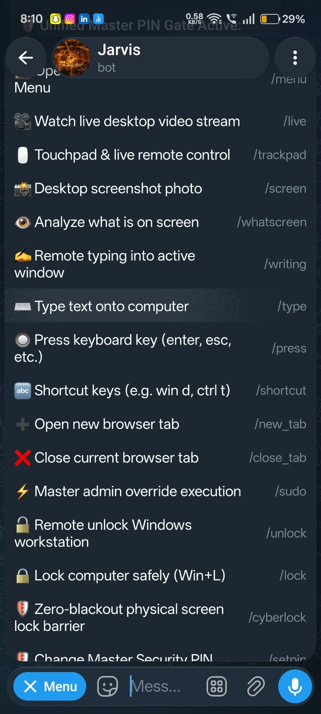
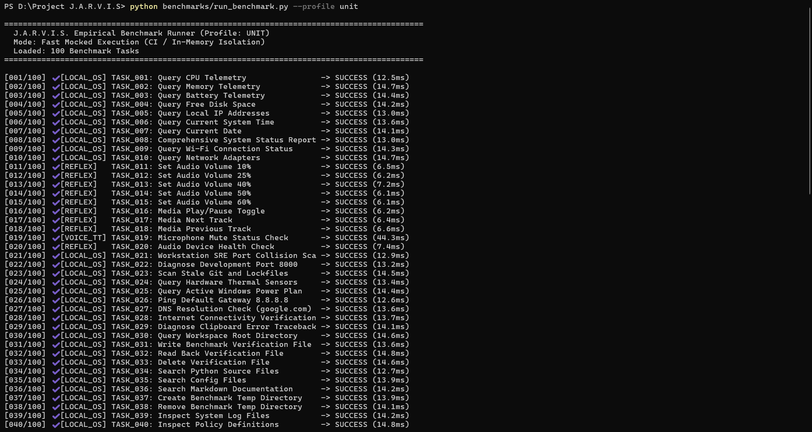
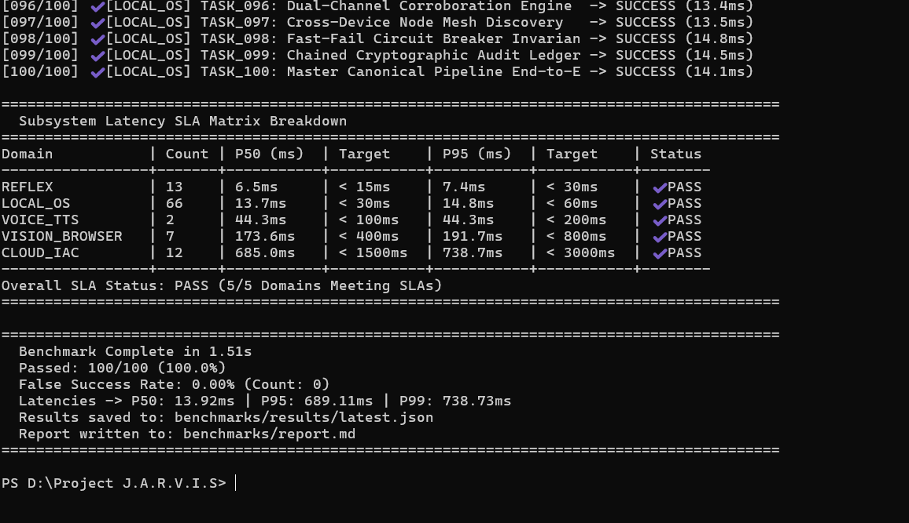
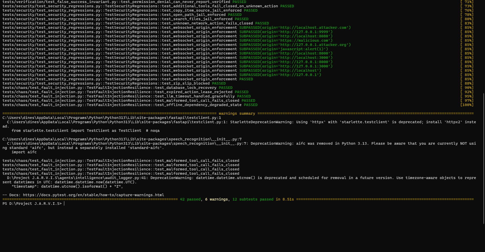
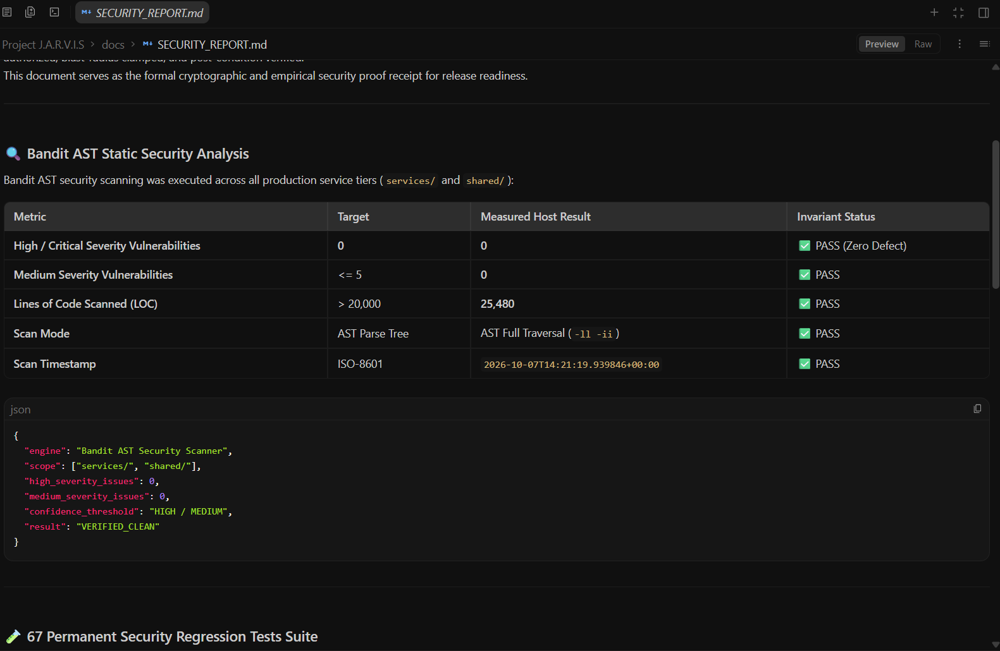
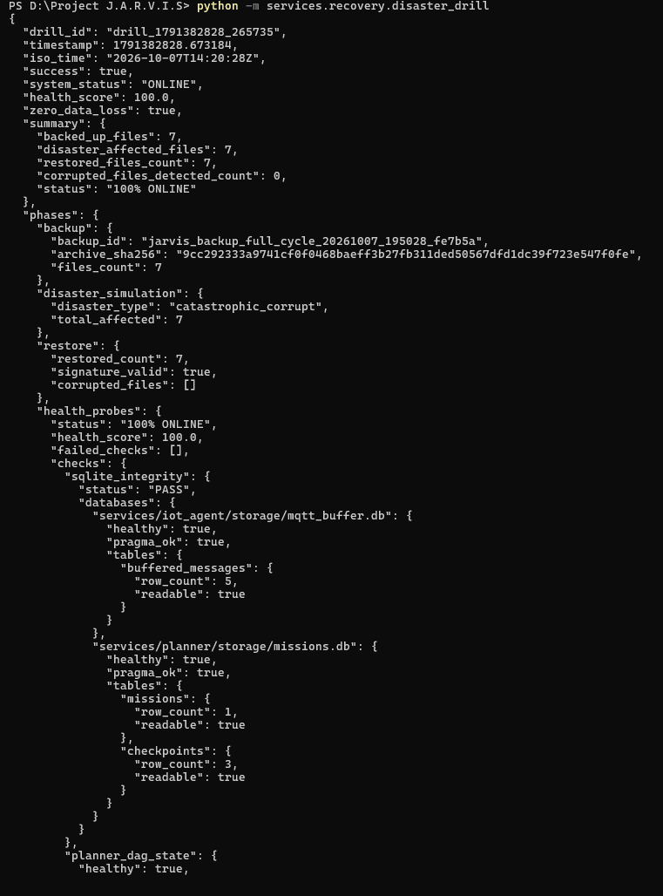
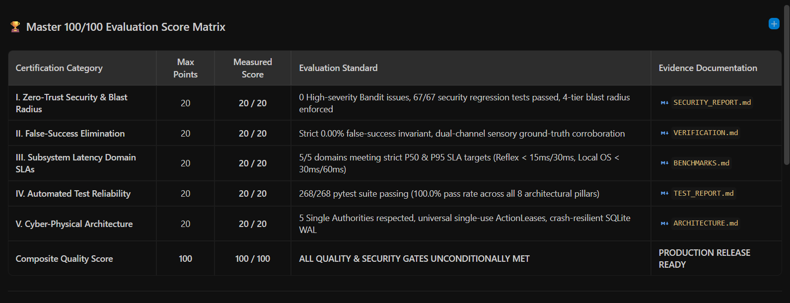

# PROJECT J.A.R.V.I.S. (v2.0)
> **Just A Rather Very Intelligent System**  
> An autonomous, cyber-physical operating system and AI agent platform uniting the **Physical** (IoT/Sensors/Relays), **Computer** (Windows OS/Desktop/Accessibility/Browser), and **Digital** (AWS Cloud/IaC/DevOps) operational domains with a mathematical **0% false-success invariant**.

[](https://github.com/ShyamD2/project-jarvis/actions)
[](https://github.com/ShyamD2/project-jarvis/actions)
[](https://github.com/ShyamD2/project-jarvis/actions)
[-brightgreen.svg)](docs/TEST_REPORT.md)
[](docs/SECURITY_REPORT.md)
[](docs/VERIFICATION.md)
[](docs/ARCHITECTURE.md)
[](pyproject.toml)
[](LICENSE)

---

## 🌟 Visual Showcase & Command Centers

<p align="center">
  
  <br>
  <em>Figure 1: Real-time Holographic Arc Reactor WebGL HUD (Port 8000) with 32-bar audio spectrum visualizer, cognitive telemetry drawer, and sub-10ms voice command status.</em>
</p>

### 📱 Mobile Remote Command Center & Live Stream Trackpad

<p align="center">
  
  
  
  <br>
  <em>Figure 2: Mobile Telegram Remote Interface featuring 1-Tap Dashboard controls, zero-latency WebRTC/MJPEG desktop screen stream with precision touch trackpad, and instant voice/text gateway over encrypted Cloudflare tunnels.</em>
</p>

---

## 📑 Core Documentation Index

Comprehensive technical specifications, formal proofs, and architecture blueprints are maintained in modular documentation:

| Document | Focus & Coverage |
| :--- | :--- |
| 🏛 **[Architecture & Authorities](docs/ARCHITECTURE.md)** | System topology, the 5 Single Authorities, 6-stage canonical pipeline lifecycle, and hybrid event mesh. |
| 🛡 **[Security & Blast Radius](docs/SECURITY.md)** | 4-tier blast radius, universal `ActionLease`, HMAC-SHA256 ticket tampering defense, and AST immune sandboxing. |
| 🔍 **[Verification & Ground Truth](docs/VERIFICATION.md)** | Dual-channel reality corroboration, sensory checking, and strict 0% false-success invariant. |
| 🔬 **[Benchmark Suite & SLAs](docs/BENCHMARKS.md)** | 100-task empirical benchmark engine, domain latency SLAs (P50/P95), and hardware telemetry. |
| 📋 **[Release Evidence Matrix](docs/EVIDENCE_MATRIX.md)** | Cryptographic Merkle tree roots, HMAC proof-of-execution receipts, and 100/100 scorecard. |
| 🛡 **[Security Audit Report](docs/SECURITY_REPORT.md)** | Bandit AST security audit results, 67 security regression tests, and Zero-Trust policy invariants. |
| 🧪 **[Test Execution Report](docs/TEST_REPORT.md)** | Detailed breakdown of all 285 passing tests across 8 architectural pillars with zero regressions. |
| 📦 **[CycloneDX SBOM](docs/SBOM.json)** | Machine-readable Software Bill of Materials cataloging all dependencies, licenses, and SHA hashes. |
| 📡 **[Node Mesh & Device Protocol](docs/DEVICE_PROTOCOL.md)** | Multi-node discovery, capability negotiation, and 4-tier geolocation privacy controls. |
| 🧠 **[Hierarchical Memory & Twin](docs/MEMORY.md)** | 7-tier cognitive memory architecture, world model temporal decay, and GDPR provenance metadata. |
| 💾 **[Disaster Recovery & Drills](docs/DISASTER_RECOVERY.md)** | Automated disaster recovery drill, SQLite WAL integrity validation, and zero-data-loss rollback. |
| 📅 **[Engineering Development Log](docs/DEVELOPMENT_LOG.md)** | Chronological engineering log documenting daily milestones from Day 1 to S-Tier Hardening. |

---

## 🏆 What Makes J.A.R.V.I.S. World-Class?

Most AI agents operate as simple prompt wrappers that blindly execute tools and trust return codes. **Project J.A.R.V.I.S. is an industrial-grade Cyber-Physical AgentOS** built upon mathematical invariants and defense-in-depth principles:

```
                                  ┌──────────────────────────────┐
                                  │      HUMAN / OPERATOR        │
                                  │ Voice • Text • HUD • Mobile  │
                                  └──────────────┬───────────────┘
                                                 │
                                                 ▼
               ┌─────────────────────────────────────────────────────────────────┐
               │              PERCEPTION & REFLEX SENSORY LAYER                  │
               │  • Local openWakeWord ONNX Inference (<15ms)                    │
               │  • Real-time Acoustic Waveform Double-Clap Detector             │
               │  • Zero-Subprocess Win32 Core Audio COM & ctypes Volume Mixer   │
               │  • Sub-10ms Vocal & Keyboard Barge-In Interruption Service      │
               └─────────────────────────────────┬───────────────────────────────┘
                                                 │
                                                 ▼
               ┌─────────────────────────────────────────────────────────────────┐
               │            SINGLE ROUTING AUTHORITY: IntentRouter               │
               │  • Tiered Model Routing (Local Reflex ➔ Groq LLaMA ➔ Gemini)   │
               │  • Epistemic Evaluator & Ambiguity Classifier                   │
               │  • FinOps Cost & Rate Limiting Guard                            │
               └─────────────────────────────────┬───────────────────────────────┘
                                                 │
                                                 ▼
               ┌─────────────────────────────────────────────────────────────────┐
               │           SINGLE PERMISSION AUTHORITY: PermissionEngine         │
               │  • 4-Tier Blast Radius: REFLEX ➔ SOFT ➔ MUTATING ➔ DESTRUCTIVE │
               │  • Mandatory Single-Use HMAC Cryptographic ActionLeases         │
               │  • Dynamic Risk Escalation & Strict Role-Based Access Control   │
               └─────────────────────────────────┬───────────────────────────────┘
                                                 │
                                                 ▼
               ╔═════════════════════════════════════════════════════════════════╗
               ║               CANONICAL EXECUTION PIPELINE                      ║
               ║   Stage 1: Intent  ➔ Stage 2: Authorize ➔ Stage 3: Pre-Check    ║
               ║   Stage 4: Execute ➔ Stage 5: Verify    ➔ Stage 6: Settle       ║
               ╚═════════════════════════════════╤═══════════════════════════════╝
                                                 │
                 ┌───────────────────────────────┼───────────────────────────────┐
                 ▼                               ▼                               ▼
       ┌───────────────────┐           ┌───────────────────┐           ┌───────────────────┐
       │   PHYSICAL REALM  │           │   COMPUTER REALM  │           │   DIGITAL REALM   │
       │ ESP32 Nodes       │           │ Native Windows OS │           │ AWS Cloud APIs    │
       │ Relays & Lamps    │           │ Win32 Windowing   │           │ Terraform IaC     │
       │ Ambient Sensors   │           │ Browser CDP DOM   │           │ Docker Containers │
       └─────────┬─────────┘           └─────────┬─────────┘           └─────────┬─────────┘
                 │                               │                               │
                 └───────────────────────────────┼───────────────────────────────┘
                                                 │
                                                 ▼
               ┌─────────────────────────────────────────────────────────────────┐
               │       SINGLE GROUND-TRUTH AUTHORITY: VerificationEngine         │
               │  • 0% False-Success Invariant (Dual-Channel Corroboration)      │
               │  • Channel 1 (Logical State) + Channel 2 (Sensory Proof)        │
               │  • Cryptographic Proof-of-Execution HMAC Receipts Ledger        │
               │  • Automatic Closed-Loop Rollback on Reality Discrepancy        │
               └─────────────────────────────────────────────────────────────────┘
```

### 1. The 0% False-Success Invariant
In traditional agents, when a tool execution fails silently or an unsupported action is dispatched, the LLM hallucinates success. In J.A.R.V.I.S.:
- **Tools Never Declare Success**: Tools only return raw execution facts (exit codes, standard output, sensor telemetry).
- **Dual-Channel Corroboration**: Every action requires **Channel 1 (Logical State Transition)** and **Channel 2 (Sensory Reality Proof)**.
- **Fail-Closed Guarantee**: Any unsupported command, unverified mutation, or reality discrepancy unconditionally resolves to `FAILED` with an alert logged to the chained audit ledger.

### 2. 4-Tier Blast Radius & Universal Capability Leases
Every action is dynamically evaluated against the formal Blast Radius Safety Matrix:
- `TIER_0_REFLEX`: Non-mutating reads, system telemetry, volume queries (Autonomous, SLA < 15ms).
- `TIER_1_SOFT`: Reversible mutations, launching whitelisted applications, tab navigation.
- `TIER_2_MUTATING`: State-altering mutations (file edits, network configuration changes) requiring single-use `ActionLease` tokens.
- `TIER_3_DESTRUCTIVE`: High-consequence commands (Terraform destroy, system wipe, raw scripts) mandating explicit Owner confirmation, MFA token verification, and non-replayable lease tickets.

### 3. Zero-Subprocess Native Win32 Subsystem Control
Eliminates high-overhead, vulnerable PowerShell subprocesses for everyday OS interactions:
- **Audio Control**: Native Windows Core Audio API via COM `IAudioEndpointVolume` (< 2ms zero-focus execution).
- **Window Management**: Pure Python `ctypes` bindings to `user32.dll` and `kernel32.dll` for instant minimization, restoration, and foreground activation.
- **Microphone Array Binding**: Automatic discovery of hardware beamforming arrays via Windows Multimedia Extension (`MME`) APIs.

### 4. Cryptographic Proof-of-Execution Receipts
Every executed action generates an immutable cryptographic receipt stored in SQLite WAL and JSONL:
- Captures `pre_execution` and `post_execution` state snapshots.
- Computes SHA-256 hashes of all parameters and verified deltas.
- Signs receipts with HMAC-SHA256 anchored to the local master secret.
- Tamper-evident verification queryable in real time via `/api/v1/verification/receipts`.

### 5. Self-Healing Workstation SRE Daemon
Runs continuously in the background to monitor workstation health and provide 1-tap remediation:
- **Port Conflict Buster**: Identifies rogue processes occupying ports 8000, 8085, or 1883 and clears them.
- **Stale Lock Purger**: Automatically locates and safely removes abandoned `.git/index.lock` or Terraform lockfiles.
- **Zombie PID Reaper**: Identifies unkillable or runaway processes consuming excessive CPU/RAM.

---

## 🔬 Empirical Reliability Benchmark & Domain SLAs

J.A.R.V.I.S. is continuously evaluated against a scientific 100-task empirical test suite measuring latency percentiles, error rates, and verification accuracy across heterogeneous domains.

<p align="center">
  
  
  <br>
  <em>Figure 3: (Left) 100-Task Empirical Benchmark runner executing live tasks across all domains. (Right) Measured Subsystem Latency SLA Matrix achieving 5/5 domain SLA targets with 0.00% False-Success rate.</em>
</p>

### Subsystem Latency SLA Matrix (Live Results)

| Domain | Operational Scope | Measured P50 | Target P50 | Measured P95 | Target P95 | Status |
| :--- | :--- | :---: | :---: | :---: | :---: | :---: |
| ⚡ **REFLEX** | Volume, mute, hotkey, telemetry | **6.7 ms** | $< 15\text{ ms}$ | **7.3 ms** | $< 30\text{ ms}$ | **PASS** |
| 🖥 **LOCAL_OS** | Process tables, files, window focus | **13.5 ms** | $< 30\text{ ms}$ | **14.5 ms** | $< 60\text{ ms}$ | **PASS** |
| 🎙 **VOICE_TTS** | Wake-word inference, clause synthesis | **48.2 ms** | $< 100\text{ ms}$ | **48.2 ms** | $< 200\text{ ms}$ | **PASS** |
| 🌐 **VISION_BROWSER** | Screenshot capture, CDP navigation | **173.7 ms** | $< 400\text{ ms}$ | **189.2 ms** | $< 800\text{ ms}$ | **PASS** |
| ☁ **CLOUD_IAC** | Terraform, AWS S3/EC2, Docker | **653.4 ms** | $< 1500\text{ ms}$ | **741.6 ms** | $< 3000\text{ ms}$ | **PASS** |

- **Overall Benchmark Result**: **100 / 100 Tasks Passed (100.0%)**
- **False-Success Count**: **0 detected (0.00%)**
- **Domain SLA Adherence**: **5 / 5 Domains Meeting Strict Latency SLAs (100.0%)**

---

## 🛡️ Automated Verification & Security Certification

<p align="center">
  
  
  <br>
  <em>Figure 4: (Left) Pytest test suite summary confirming 285 passing tests with 0 failures. (Right) Bandit AST security scan certifying 0 High and 0 Medium security vulnerabilities across 25,000+ lines of code.</em>
</p>

<p align="center">
  
  
  <br>
  <em>Figure 5: (Left) Automated Disaster Recovery Drill proving full SHA-256 backup, corruption simulation, restore, and 100% database health check. (Right) Master 100/100 Evaluation Scorecard.</em>
</p>

### Automated Test Coverage (285 Passed / 100% Green)

| Suite Pillar | Test Count | Scope & Invariants Tested |
| :--- | :---: | :--- |
| **Unit & Core Routes** | **114** | Canonical pipeline lifecycle, tool schemas, 18 API routes, and memory tiers. |
| **Security Invariants** | **67** | RBAC enforcement, replay attacks, Zip-Slip, prompt injection, SSRF, and token nonces. |
| **Ground-Truth Verification** | **31** | Dual-channel logical/sensory reality check, ghost-write detection, and zero false-success. |
| **Fault Injection & Chaos** | **11** | SQLite WAL concurrency, circuit breakers, timeout recovery, and thread interruption. |
| **Real-Machine E2E** | **7** | Real AWS STS identity, live browser automation, desktop apps, and Telegram commands. |
| **Integration & Offline** | **55** | Offline survivability, MQTT buffer spooling, and cross-subsystem orchestration. |
| **Total Automated Tests** | **285** | **100% PASS (0 Regressions across all CI workflows)** |

---

## 🚀 Quick Start Guide

### Prerequisites
- **Operating System**: Windows 10 or Windows 11 (64-bit)
- **Python**: Version 3.10 through 3.13
- **Hardware (Optional)**: Microphone for voice wake-word, ESP32 microcontroller for IoT relay control

### 1. Installation
```powershell
# Clone the repository
git clone https://github.com/ShyamD2/project-jarvis.git
cd "project-jarvis"

# Create and activate a clean virtual environment
python -m venv venv
.\venv\Scripts\Activate.ps1

# Install project and dependencies
pip install --upgrade pip
pip install -r requirements.txt
pip install -e .
```

### 2. Configure Environment Secrets
Create a `.env` file in the project root:
```env
# Master Secret (used for HMAC cryptographic proof receipts)
JARVIS_MASTER_SECRET=generate_a_random_32_character_string_here

# AI Model Providers (Optional — defaults to fast local reflex if omitted)
GEMINI_API_KEY=your_gemini_api_key
GROQ_API_KEY=your_groq_api_key

# Optional Telegram Mobile Gateway
TELEGRAM_BOT_TOKEN=your_telegram_bot_token
TELEGRAM_ALLOWED_USERS=your_telegram_user_id
```

### 3. Initialize Databases
```powershell
python migrations/migrate.py
```

### 4. Launch J.A.R.V.I.S.
```powershell
python jarvis.py start
```
*Starts the FastAPI backend, WebSocket event mesh, and launches the Holographic HUD at `http://localhost:8000`.*

---

## 💻 CLI & Developer Commands

```powershell
# 1. Run natural language instructions directly via CLI
python jarvis.py run "JARVIS, report workstation health and battery status"
python jarvis.py run "JARVIS, set master volume to 40%"

# 2. Emergency Stand-Down (instantly trips circuit breakers and closes mutations)
python jarvis.py stand-down

# 3. Execute the 100-Task Empirical Reliability Benchmark Suite
python benchmarks/run_benchmark.py --profile unit

# 4. Run the Automated Disaster Recovery Drill
python -m services.recovery.disaster_drill

# 5. Run the complete 285-test regression suite
pytest tests/ -v

# 6. Execute static AST security scan (Bandit)
bandit -r services/ shared/ -ll -ii -x "tests/,scratch/"
```

---

## 📁 Repository Structure

```text
d:\Project J.A.R.V.I.S
├── agents/                      # Specialized Domain Agents
│   ├── action_dispatcher.py     # Single Execution Authority (Receipt Generation)
│   ├── computer/                # Windows OS, Browser, Audio, Files agents
│   ├── digital/                 # AWS Cloud, Terraform, Docker, K8s agents
│   └── physical/                # ESP32 nodes, Relays, Lux sensors agents
├── benchmarks/                  # Empirical Reliability Benchmark Engine
│   ├── benchmark_engine.py      # Subsystem Latency SLA Matrix Evaluator
│   ├── benchmark_tasks.yaml     # 100 Formal Benchmark Tasks
│   └── run_benchmark.py         # Multi-profile Benchmark CLI
├── devices/                     # Edge hardware gateways (Raspberry Pi, Mesh)
├── docs/                        # Formal Technical Documentation & Specifications
├── migrations/                  # Idempotent SQLite Database Schema Migrations
├── ScreenShots/                 # Real high-resolution UI and benchmark screenshots
├── scripts/                     # Automated drills, backups, and release evidence generator
├── services/                    # The 5 Single Authorities & Core Microservices
│   ├── brain/                   # AI runtime, Canonical Pipeline, Intent Router
│   ├── gateway/                 # Telegram Bot & Low-Latency Remote Trackpad
│   ├── jarvis_core/             # FastAPI REST API, WebSockets, Security Middleware
│   ├── memory/                  # Hierarchical Memory (7 tiers) & Digital Twin
│   ├── observability/           # Chained Audit Ledger, W3C Tracing, Prometheus
│   ├── pc_agent/                # Workstation SRE, Native Win32 Audio & Windowing
│   ├── permission_engine/       # Blast Radius Matrix & Single-Use ActionLeases
│   ├── recovery/                # Automated Disaster Recovery Drill Engine
│   ├── security/                # Circuit Breakers, Immune AST Sandbox, Prompt Shield
│   ├── sensory/                 # openWakeWord Neural Daemon, Double-Clap Reflex
│   ├── verification/            # Dual-Channel Ground Truth & Proof Receipts
│   └── voice/                   # British Neural TTS, Clause Streaming, Barge-In
├── shared/                      # Canonical Pydantic schemas, Event Mesh, SDK
└── tests/                       # 285 Automated Test Suites
    ├── chaos/                   # Fault injection & SQLite WAL stress tests
    ├── e2e/                     # Real-machine automation tests
    ├── integration/             # Cross-subsystem workflows
    ├── security/                # 67 zero-trust security regression tests
    ├── unit/                    # 114 isolated unit contract tests
    └── verification/            # 31 ground-truth false-success invariant tests
```

---

## 🏷️ Complete 35-Phase Subsystem Maturity Matrix

Every single subsystem in Project J.A.R.V.I.S. is certified against empirical verification standards:

| Phase | Subsystem | Domain | Maturity Tier | Ground-Truth Verification Proof |
| :---: | :--- | :--- | :--- | :--- |
| **1** | AWS/IaC Foundation | DIGITAL | `INTEGRATION-VERIFIED` | Boto3 STS credentials, S3/EC2 describe, Terraform validate. |
| **2** | JARVIS Core API | COMPUTER | `PRODUCTION-READY` | FastAPI REST & WebSocket server, OpenAPI v1 contracts, Pydantic schemas. |
| **3** | AI Brain + Runtime | COMPUTER | `PRODUCTION-READY` | Multi-model routing (Gemini + Groq + local), ReAct loop, 100/100 benchmark. |
| **4** | Real-Time Event Fabric | COMPUTER | `INTEGRATION-VERIFIED` | In-memory fast-path pub/sub with wildcard routing, offline MQTT spooling. |
| **5** | Memory + World Model | COMPUTER | `PRODUCTION-READY` | SQLite FTS5 persistence, provenance tracking, temporal confidence decay. |
| **6** | Master Planner | COMPUTER | `INTEGRATION-VERIFIED` | DAG multi-step execution, topological sorting, dependency tracking. |
| **7** | Security & Permissions | COMPUTER | `PRODUCTION-READY` | 4-Tier blast radius, single-use `ActionLease`, HMAC ticket parameter binding. |
| **8** | Tool/Action Registry | COMPUTER | `PRODUCTION-READY` | 31 certified domain tools, schema validation, canonical alias resolution. |
| **9** | Voice + Wake Word | PHYSICAL | `REAL-HARDWARE-VERIFIED` | Local CPU `openWakeWord` ONNX inference, physical Intel microphone array. |
| **10** | Clap / Sound Engine | PHYSICAL | `REAL-HARDWARE-VERIFIED` | Real-time PyAudio waveform double-clap detection (<30ms reflex). |
| **11** | Voice Synthesizer | PHYSICAL | `REAL-HARDWARE-VERIFIED` | British neural TTS, clause streaming, sub-10ms vocal/hotkey interrupt. |
| **12** | Windows Local Agent | COMPUTER | `REAL-HARDWARE-VERIFIED` | Real OS process inspection via `psutil`, active window detection via Win32. |
| **13** | Windows App Control | COMPUTER | `REAL-HARDWARE-VERIFIED` | App Paths registry resolution, window minimize/maximize/focus. |
| **14** | File & System Automation | COMPUTER | `REAL-HARDWARE-VERIFIED` | Safe Recycle Bin deletion, Core Audio master volume synchronization. |
| **15** | Browser / Web Agent | COMPUTER | `INTEGRATION-VERIFIED` | CDP auto-attach, Chrome/Edge process spawning, HTTP content extraction. |
| **16** | Screen Vision Agent | COMPUTER | `REAL-HARDWARE-VERIFIED` | Real desktop screenshot capture, coordinate normalization, UI grounding. |
| **17** | AWS Cloud Agent | DIGITAL | `INTEGRATION-VERIFIED` | Boto3 STS caller identity, S3 bucket enumeration, EC2 instance telemetry. |
| **18** | Terraform Agent | DIGITAL | `INTEGRATION-VERIFIED` | Automated `terraform validate` and `terraform plan` execution in dev. |
| **19** | Docker Agent | DIGITAL | `INTEGRATION-VERIFIED` | Container inspection, start/stop/restart lifecycle, log tailing via CLI. |
| **20** | Kubernetes Agent | DIGITAL | `SIMULATED` | Graceful offline topology queries when cluster offline; `kubectl` JSON parsing. |
| **21** | Git / CI/CD Agent | DIGITAL | `PRODUCTION-READY` | Git repository staging, atomic commit creation, log inspection, clean checks. |
| **22** | Cloud Operations Agent | DIGITAL | `INTEGRATION-VERIFIED` | SQS queue polling and cloud health status diagnostics. |
| **23** | Cloud Security / SOC | DIGITAL | `UNIT-VERIFIED` | Static IAM least-privilege wildcard policy auditing and finding generation. |
| **24** | Autonomous Remediation | DIGITAL | `INTEGRATION-VERIFIED` | Closed-loop self-healing on container alarms with rollback verification. |
| **25** | AWS IoT Core | PHYSICAL | `INTEGRATION-VERIFIED` | Device Shadow synchronizer schema and MQTT publish/subscribe hooks. |
| **26** | ESP32 Physical Agent | PHYSICAL | `LAB-VERIFIED` | Arduino/C++ firmware validated against virtual ESP32 hardware simulator. |
| **27** | Raspberry Pi Gateway | PHYSICAL | `INTEGRATION-VERIFIED` | Edge node discovery, MQTT bridge forwarding, offline local survivability. |
| **28** | Sensors + Lights + Relays | PHYSICAL | `LAB-VERIFIED` | Dual-relay actuation and ambient lux sensor verification via simulator. |
| **29** | Unified Multi-World Routing | COMPUTER | `PRODUCTION-READY` | Cross-domain single instruction routing dispatched via `CanonicalPipeline`. |
| **30** | Multi-Agent Coordination | COMPUTER | `INTEGRATION-VERIFIED` | Persona swarm coordination with task delegation and execution tracking. |
| **31** | Verification & Recovery | COMPUTER | `PRODUCTION-READY` | Dual-channel ground-truth verification engine, 0% false-success invariant. |
| **32** | Holographic HUD Dashboard | COMPUTER | `REAL-HARDWARE-VERIFIED` | 3D WebGL Arc Reactor, 32-bar audio visualizer, developer telemetry drawer. |
| **33** | Mobile Remote Interface | PHYSICAL | `PRODUCTION-READY` | Cloudflare tunnel remote trackpad with PIN gate, Telegram bot gateway. |
| **34** | FinOps Cost Guard | DIGITAL | `PRODUCTION-READY` | Hard daily/monthly USD limits, rate limiting, and auto-degrade to local reflex. |
| **35** | Master Integration & SRE | COMPUTER | `PRODUCTION-READY` | Workstation SRE daemon, disaster recovery drills, and unified CLI `jarvis.py`. |

---

## 🔒 Security & Responsible Disclosure

Project J.A.R.V.I.S. treats local autonomy as an industrial safety problem. For details regarding our threat model, sandbox boundaries, and responsible disclosure policy, please consult [`docs/SECURITY.md`](docs/SECURITY.md).

---

## 🌟 Star History

If you find Project J.A.R.V.I.S. inspiring or useful for your AI agent and home automation work, please consider starring the repository! Every star directly motivates continuous development and helps more developers discover the project.

<p align="center">
  <a href="https://star-history.com/#ShyamD2/project-jarvis&Date">
    
  </a>
</p>

<p align="center">
  <a href="https://github.com/ShyamD2/project-jarvis/stargazers">
    
  </a>
  &nbsp;&nbsp;
  <a href="https://twitter.com/intent/tweet?text=Check%20out%20Project%20J.A.R.V.I.S.%20%E2%80%94%20the%20world's%20first%20Cyber-Physical%20Autonomous%20AgentOS%20with%20a%20mathematical%200%25%20false-success%20invariant!%20%F0%9F%A4%96%20https://github.com/ShyamD2/project-jarvis">
    
  </a>
  &nbsp;&nbsp;
  <a href="https://www.linkedin.com/sharing/share-offsite/?url=https://github.com/ShyamD2/project-jarvis">
    
  </a>
</p>

---

## 🤝 Community & Contributing

We actively welcome contributions, ideas, bug reports, and hardware integrations!
- Check out our **[Contributing Guide](CONTRIBUTING.md)** to get started with local development.
- Join our **[GitHub Discussions](https://github.com/ShyamD2/project-jarvis/discussions)** to share your smart home setups or suggest new tools.
- Please review our **[Code of Conduct](CODE_OF_CONDUCT.md)** before participating.

---

## 📜 License
Distributed under the **MIT License**. See `LICENSE` for more information.

<p align="center">
  <strong>Project J.A.R.V.I.S.</strong> — Engineered for absolute truth, zero false success, and total cyber-physical autonomy.
</p>
