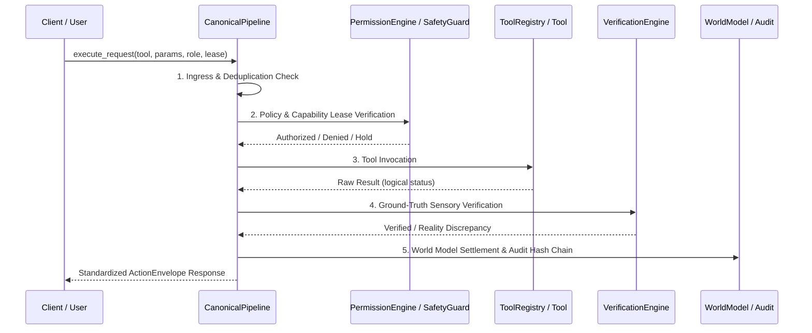

# System Architecture & Engineering Contracts

## Overview
Project J.A.R.V.I.S. is an autonomous, cyber-physical operating system engineered to bridge the **Physical** (IoT/Sensors/Relays), **Computer** (Windows OS/Desktop/Accessibility/Browser), and **Digital** (AWS Cloud/IaC/DevOps) operational domains.

The platform is designed around strict separation of concerns, deterministic execution pipelines, cryptographic access controls, and dual-channel sensory verification.

---

## 🏛 Master Architecture

```
                         ┌──────────────────────┐
                         │         YOU          │
                         │ Voice / Phone / Web  │
                         │ Clap / Gesture       │
                         └──────────┬───────────┘
                                    │
                                    ▼
                    ┌─────────────────────────────┐
                    │     JARVIS EXPERIENCE       │
                    │ Voice • Text • Dashboard    │
                    │ Mobile • Notifications      │
                    └─────────────┬───────────────┘
                                  │
══════════════════════════════════╪══════════════════════════════════
                                  ▼
                 ┌────────────────────────────────┐
                 │       JARVIS SENSORY LAYER     │
                 │ 🎤 Voice / Wake Word           │
                 │ ⚡ Sub-10ms Interrupt Service  │
                 │ 👏 Sound / Clap Detection      │
                 │ 📷 Camera / Vision             │
                 │ 🖥 Screen / UI Understanding  │
                 └───────────────┬────────────────┘
                                 ▼
                 ┌────────────────────────────────┐
                 │      REAL-TIME EVENT FABRIC    │
                 │ Local Fast-Path (<30ms) & AWS  │
                 └───────────────┬────────────────┘
                                 ▼
              ┌──────────────────────────────────────┐
              │             JARVIS BRAIN             │
              │ Tiered Multi-Model (Gemini / Groq)   │
              │ Intent Understanding & Agent Runtime │
              └────────────────┬─────────────────────┘
                               │
             ┌─────────────────┼──────────────────┐
             ▼                 ▼                  ▼
      ┌──────────────┐ ┌──────────────┐ ┌────────────────┐
      │ WORLD MODEL  │ │   MEMORY     │ │ KNOWLEDGE/RAG  │
      │ Digital Twin │ │ Short/Long   │ │ Runbooks       │
      └──────┬───────┘ └──────┬───────┘ └───────┬────────┘
             └─────────────────┼─────────────────┘
                               ▼
                 ┌─────────────────────────────┐
                 │   MASTER ORCHESTRATOR       │
                 │ Task DAG Parallel Engine    │
                 └──────────────┬──────────────┘
                                ▼
                 ┌─────────────────────────────┐
                 │    SECURITY / AUTH ENGINE   │
                 │ 4-Tier Blast Radius Matrix  │
                 │ Emergency Stand-Down Breaker│
                 └──────────────┬──────────────┘
                                ▼
                  ╔═══════════════════════════╗
                  ║   CANONICAL PIPELINE      ║
                  ╚══════════════╤════════════╝
                                 │
       ┌─────────────────────────┼──────────────────────────┐
       ▼                         ▼                          ▼
┌───────────────┐       ┌──────────────────┐       ┌─────────────────┐
│ DIGITAL WORLD │       │ COMPUTER WORLD   │       │ PHYSICAL WORLD  │
│ AWS Cloud     │       │ Windows OS       │       │ ESP32 Nodes     │
│ Terraform IaC │       │ Apps & Terminal  │       │ Relays & Lamps  │
│ LocalStack    │       │ Browser & Screen │       │ Ambient Lux     │
└───────┬───────┘       └────────┬─────────┘       └────────┬────────┘
        │                        │                          │
        └────────────────────────┼──────────────────────────┘
                                 ▼
                  ┌──────────────────────────┐
                  │   VERIFICATION ENGINE    │
                  │ Dual-Channel Real State  │
                  └────────────┬─────────────┘
                               ▼
                        JARVIS RESPONSE
```

---

## 🔒 The Five Single Authorities of J.A.R.V.I.S.

To prevent architectural entropy, duplicate systems, and conflicting authority, the codebase enforces five single authorities across all workflows:

### 1. Execution Authority: `CanonicalPipeline`
- **Location:** `services/brain/canonical_pipeline.py`
- **Responsibility:** Every action request (from voice, CLI, Telegram, web dashboard, or autonomous planner) must route through `canonical_pipeline.execute_request()`.
- **Invariants:**
  - Standardized 6-stage lifecycle: **Ingress** $\rightarrow$ **Policy Check** $\rightarrow$ **Permission Evaluation** $\rightarrow$ **Execution** $\rightarrow$ **Verification** $\rightarrow$ **World Model Settlement**.
  - Request deduplication with 300-second TTL.
  - Three distinct execution classes: `REFLEX` (<50ms, read-only/soft), `COGNITIVE` (LLM-orchestrated), and `MISSION` (multi-step DAG).
  - W3C Trace Context propagation (`traceparent` header) for end-to-end distributed tracing.

### 2. Security Authority: `SafetyGuard` & `PermissionEngine`
- **Locations:** `agents/intelligence/safety_guard.py` & `services/permission_engine/engine.py`
- **Responsibility:** Evaluates caller identity, role-based access control (RBAC), tier constraints, and cryptographic leases.
- **Invariants:**
  - 4-Tier blast radius enforcement (`TIER_0_READ_ONLY`, `TIER_1_SOFT`, `TIER_2_MUTATING`, `TIER_3_DESTRUCTIVE`).
  - Single-use universal action leases (`ActionLease`) with cryptographic nonces and 300s TTL.
  - HMAC-SHA256 parameter binding preventing confirmation tampering and replay attacks.
  - Sub-millisecond Emergency STOP circuit breaker (`emergency_stop.py`) with physical hotkey (`Ctrl + Shift + J`).

### 3. Tool Authority: `ToolRegistry`
- **Location:** `services/brain/tools/registry.py`
- **Responsibility:** Single catalog of certified domain tools.
- **Invariants:**
  - Strict parameter validation against JSON Schema definitions.
  - Canonical tool name resolution and health probes (`AVAILABLE`, `DEGRADED`, `UNAVAILABLE`, `BLOCKED`).
  - AST-sandboxed execution preventing unauthorized system tampering.

### 4. Verification Authority: `VerificationEngine`
- **Location:** `services/verification/verification_engine.py`
- **Responsibility:** Independent ground-truth physical verification.
- **Invariants:**
  - Dual-channel corroboration (logical tool return code + sensory OS/physical reality).
  - Inspects real host process tables (`psutil`), port listeners, filesystem inodes, and Docker container states.
  - Rejects false-success claims when tools report success but physical reality contradicts.

### 5. Audit Authority: `ChainedAuditLedger`
- **Location:** `services/observability/chained_audit_ledger.py`
- **Responsibility:** Tamper-evident cryptographic logging.
- **Invariants:**
  - Cryptographic hash-chained blocks linking each event's SHA-256 hash to the preceding block.
  - First-class REST API endpoints (`/api/v1/audit/events`, `/api/v1/audit/recent`).
  - Immutability guarantee: any retroactive modification invalidates the ledger chain.

---

## ⚡ Execution Pipeline Lifecycle

Every request follows an immutable 6-stage lifecycle:



---

## 🌐 Hybrid Event Mesh

- **Local Fast-Path:** MQTT broker on port 1883 for sub-millisecond on-device dispatch between sensory daemons, floating HUD, and desktop automation agents.
- **In-Memory Fallback:** When MQTT broker is offline, the event mesh transparently falls back to an asynchronous in-memory pub/sub queue without dropping events.
- **Cloud Pub/Sub:** AWS EventBridge integration for asynchronous cross-region cloud events and alerting.
