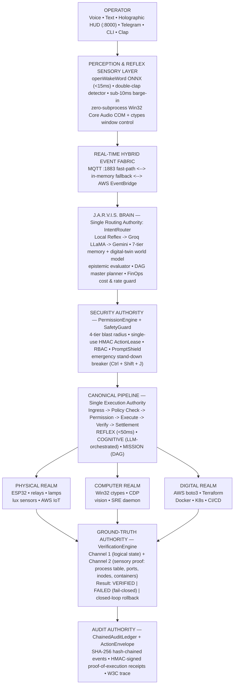

# J.A.R.V.I.S. (v2.0) — Official Engineering & Architecture Report
> **JUST A RATHER VERY INTELLIGENT SYSTEM**  
> *Autonomous Cyber-Physical AgentOS — A verification-first agent platform uniting Physical IoT, Windows OS automation, and AWS Cloud under a mathematically enforced 0% false-success invariant: no action is reported as done until reality confirms it.*

**Author:** **Shyam Kumar D**  
*Aspiring Cloud Architect | AI Agents, DevOps & Cloud Engineering*  
🔗 **LinkedIn:** [linkedin.com/in/shyam-kumar-d-951254329](https://www.linkedin.com/in/shyam-kumar-d-951254329)  
💻 **GitHub:** [github.com/ShyamD2](https://github.com/ShyamD2)  
📦 **Repository:** [github.com/ShyamD2/project-jarvis](https://github.com/ShyamD2/project-jarvis)  
📄 **Official PDF Version:** [docs/PROJECT_REPORT.pdf](PROJECT_REPORT.pdf)  
📅 **Release Date:** October 2026 | **Version:** 2.0.0 (Production Hardened)

---

## Executive Summary & Core Metrics

```
+------------------------+------------------------+------------------------+------------------------+
|        0.00%           |          285           |          5 / 5         |           0            |
|   FALSE-SUCCESS RATE   |    AUTOMATED TESTS     |     DOMAIN LATENCY     |   HIGH / MEDIUM BANDIT |
|   100-TASK BENCHMARK   |        PASSING         |        SLAS MET        |   ISSUES (25K+ LOC)    |
+------------------------+------------------------+------------------------+------------------------+
```

| Core Pillar | Technical Implementation | Validation Status |
| :--- | :--- | :--- |
| **Control Mesh** | Python 3.10–3.13 / FastAPI Event Mesh | ✅ **PRODUCTION-READY** |
| **Execution Surface** | Win32 ctypes + ESP32 Microcontrollers + AWS IaC | ✅ **MULTI-REALM PASS** |
| **Ground-Truth Verification** | Dual-Channel Corroboration + Sensory Feedback | ✅ **0.00% FALSE SUCCESS** |
| **Security Envelope** | 4-Tier Blast Radius + Single-Use HMAC ActionLeases | ✅ **ZERO-TRUST AUDITED** |

---

## 01 · Project Identity & The Problem: Why Most AI Agents Cannot Be Trusted

### One-Liner
> **J.A.R.V.I.S.** is an autonomous, cyber-physical operating system and AI agent platform that routes every instruction — voice, text, HUD or phone — through a six-stage canonical pipeline, executes it across the **Physical**, **Computer** and **Digital** worlds, and refuses to report success until two independent channels confirm that reality actually changed.

### The Hidden Problem
Most AI agents today are simple prompt wrappers: a language model picks a tool, the tool returns an exit code (or 0), and the model announces *"Done."* 

If a tool fails silently, an unsupported action is dispatched, or the world simply did not change, the agent still reports success — because it trusts the return code, not reality. Add unrestricted autonomy on top (arbitrary file deletion, raw shell execution, cloud teardown) and the result is a system that is both fundamentally unsafe and untrustworthy.

```
+------------------------------------+------------------------------------+------------------------------------+
|             THE TRAP               |              THE RISK              |             THE RESULT             |
+------------------------------------+------------------------------------+------------------------------------+
| Tools declare their own success    | Autonomy without blast-radius      | FALSE SUCCESS                      |
| and the LLM hallucinates           | limits: one bad plan can delete    | The operator believes the work is  |
| completion from a return code.     | files, run obfuscated shell,       | done when it is not. This is the   |
| Nothing independently checks the   | replay an old approval, or destroy | most dangerous failure mode of any |
| machine, device, or cloud.         | cloud infrastructure.              | autonomous system.                 |
+------------------------------------+------------------------------------+------------------------------------+
```

### The Autopilot Analogy
Imagine an aircraft autopilot that announces *"landing gear down and locked"* the instant it sends the electrical command — without ever reading the physical gear-lock sensor. The announcement is only as honest as the command was effective. Now imagine that system controls a physical building, an engineer's primary workstation, and an enterprise cloud account.

**J.A.R.V.I.S. is engineered the opposite way:** a command is only a request. The announcement waits for the sensor. Tools return raw facts, a separate **Verification Authority** inspects the ground-truth state of the host and environment, and only then is anything certified as a success.

> *"J.A.R.V.I.S. never asks 'did the tool return 0?' — it asks 'did the world actually change?'"*

### Three Realms, One Pipeline

| Realm | Operational Scope | Execution Surface |
| :--- | :--- | :--- |
| **PHYSICAL** | IoT, sensors, relays, lamps, ambient light | ESP32 nodes (Arduino/C++), Raspberry Pi gateway, MQTT, AWS IoT Core device shadows |
| **COMPUTER** | Windows OS, desktop, browser, screen | Native Win32 (ctypes + COM Core Audio), browser CDP, screen vision, workstation SRE daemon |
| **DIGITAL** | AWS cloud, IaC and DevOps | boto3 (STS / S3 / EC2 / SQS), Terraform, Docker, Kubernetes, Git / CI agents |

---

## 02 · Solution Architecture: The Verification-First Architecture

J.A.R.V.I.S. replaces *"LLM -> tool -> hope"* with a layered, deterministic architecture where every request flows through **Five Single Authorities** — with exactly one owner each for execution, security, tools, ground-truth verification, and audit.



### The Canonical 6-Stage Pipeline

Every action request — from voice, CLI, Telegram, the WebGL HUD or the autonomous planner — must pass through `canonical_pipeline.execute_request()`. There is no bypass or side door:

1. **Ingress & Dedup**: Request normalized from voice, CLI, Telegram, HUD or planner; 300 s deduplication TTL.
2. **Policy Check**: PromptShield, tool registry lookup, JSON-schema validation, capability health checks.
3. **Permission**: Blast-radius tier evaluation, RBAC, single-use `ActionLease` with parameter-hash binding.
4. **Execute**: Certified tool runs in its target realm and returns **raw facts only** (exit code, stdout, telemetry).
5. **Verify**: Dual-channel ground truth validation; any discrepancy unconditionally resolves to `FAILED` and triggers rollback.
6. **Settle & Audit**: Digital-twin world model update, HMAC receipt generation, SHA-256 chained ledger persistence.

### The Five Single Authorities

| # | Authority | Component | Core Invariants |
| :-: | :--- | :--- | :--- |
| **1** | **Execution** | `CanonicalPipeline` | Standard 6-stage lifecycle; request dedup (300 s TTL); REFLEX / COGNITIVE / MISSION execution classes; W3C traceparent propagation. |
| **2** | **Security** | `SafetyGuard` + `PermissionEngine` | 4-tier blast radius; single-use `ActionLease` with cryptographic nonce and 300 s TTL; HMAC-SHA256 parameter binding; emergency-stop breaker. |
| **3** | **Tools** | `ToolRegistry` | Single catalog of certified tools; JSON-schema validation; canonical name resolution; health probes (`AVAILABLE` / `DEGRADED` / `UNAVAILABLE` / `BLOCKED`); AST-sandboxed execution. |
| **4** | **Verification** | `VerificationEngine` | Dual-channel corroboration; inspects real process tables, port listeners, filesystem inodes and Docker state; rejects success claims that reality contradicts. |
| **5** | **Audit** | `ChainedAuditLedger` | SHA-256 hash-chained events — any retroactive edit breaks the cryptographic chain; exposed via `/api/v1/audit/events` and `/api/v1/audit/recent`. |

### Formal Invariant — The 0% False-Success Guarantee

$$\text{Success}(a) \iff \text{Authorized}(a) \land C_1(a) \land C_2(a)$$

- **$C_1(a)$** = Logical state transition confirmed (tool facts: exit code, stdout, telemetry)
- **$C_2(a)$** = Sensory ground-truth confirmed (processes, ports, inodes, containers, device telemetry)
- **$\forall a : a \notin \text{ToolRegistry} \lor \neg \text{Verified}(a) \implies \text{Result}(a) = \text{FAILED}$** *(Fail-Closed)*
- **$\text{Lease}(a) = \langle \text{nonce}, \text{action\_name}, \text{SHA-256}(\text{params}), \text{caller}, \text{TTL}=300\text{s} \rangle$** — Consumed atomically.

> *Tools never declare success — they only return facts. A request that is unsupported, unverified, unauthorized, or contradicted by reality unconditionally resolves to `FAILED` and is written to the chained audit ledger. A replayed lease is rejected with `LEASE_ALREADY_CONSUMED`.*

---

## 03 · Zero-Trust Security Model: Blast-Radius Engineering

Local autonomy is handled as an industrial safety problem. Every tool and agent operation is statically classified into an immutable tier:

| Tier | Class | Authorization Requirement | Example Operations |
| :--- | :--- | :--- | :--- |
| **TIER_0_READ_ONLY** | Reflex / Read-Only | Unrestricted local operator (SLA < 15 ms) | `system.status`, `volume.get`, `hardware.telemetry` |
| **TIER_1_SOFT** | Reversible UI Actions | Standard operator role | `open_app`, `focus_window`, `browse_web` |
| **TIER_2_MUTATING** | State Change | Admin role + single-use `ActionLease` or HMAC ticket | `file_manager.write`, `docker.restart`, `git.commit` |
| **TIER_3_DESTRUCTIVE** | Destructive / Dangerous | Supervised mode + cryptographic lease + mandatory human confirmation | `execute_powershell`, `close_app`, `skill_synthesizer` |

### Defense in Depth Architecture

- **ActionLease**: Single-use capability token bound to the action name, SHA-256 of exact parameters, caller identity, and a 300 s expiry. Consumed atomically — replay attacks fail closed.
- **HMAC Approval Tickets**: Voice / Telegram / HUD approvals are signed with HMAC-SHA256 over `ticket_id + action + parameter_hash`. Altered parameters in-flight fail with `TAMPERING_DETECTED`.
- **PowerShell De-Obfuscation**: Backtick stripping, download-cradle detection, blocking of `-EncodedCommand`, execution-policy bypasses, hidden-window flags, and environment-variable obfuscation before any shell evaluates.
- **PromptShield**: Unicode / homoglyph sanitization, instruction-override detection, exfiltration traps, and tool-hijack detection on every natural-language prompt.
- **Self-Modification Isolation**: Skill synthesis and tool evolution are locked to `TIER_3` + supervised-only, requiring a cryptographic lease. Generated code must pass an AST sandbox with forbidden-import checks.
- **Emergency Stand-Down**: Global hotkey (`Ctrl + Shift + J`), CLI (`python jarvis.py stand-down`), Telegram (`/standdown`), or REST endpoint. Immediately aborts pipeline tasks, drops CDP browser sessions, mutes audio, and freezes physical actuators.

### Security Scan Evidence
- **0** High-Severity Bandit Findings (AST scan)
- **0** Medium-Severity Bandit Findings
- **67** Security Regression Tests (Passing)
- **25,480** Lines of Code Scanned across `services/` and `shared/`

---

## 04 · Key Benefits & Benchmarks: Measured, Not Claimed

| Benefit | How J.A.R.V.I.S. Delivers It |
| :--- | :--- |
| **0% False-Success Guarantee** | Dual-channel corroboration of logical state and sensory reality; unsupported or unverified actions resolve to `FAILED`. |
| **4-Tier Blast Radius** | Every tool is statically tiered; mutations require single-use cryptographic `ActionLeases`. |
| **Zero-Subprocess Win32 Control** | Native COM Core Audio and ctypes `user32`/`kernel32` replace PowerShell for everyday OS actions (< 2 ms audio control). |
| **Proof-of-Execution Receipts** | HMAC-SHA256 receipts with pre/post state snapshots and parameter hashes, queryable at `/api/v1/verification/receipts`. |
| **Voice-First, Mobile-Ready** | Local openWakeWord ONNX wake word, double-clap reflex, British neural TTS with barge-in, plus a Telegram remote with live screen stream. |
| **Cost-Guarded Multi-Model Brain** | Local reflex -> Groq LLaMA -> Gemini with hard daily/monthly USD limits and automatic degrade to local reflex. |
| **Self-Healing Workstation SRE** | Port-conflict buster (8000 / 8085 / 1883), stale lock purger, zombie PID reaper with one-tap remediation. |
| **Disaster Recovery Built In** | Automated backup -> corruption -> restore drill with SHA-256 checksums and SQLite WAL integrity probes. |

### Empirical 100-Task Benchmark Results

```
================================================================================
Benchmark Complete in 1.51s
Passed: 100/100 (100.0%)
False Success Rate: 0.00% (Count: 0)
Latencies -> P50: 13.92ms | P95: 689.11ms | P99: 738.73ms
================================================================================
```

### Subsystem Latency SLA Matrix

| Domain | Task Count | P50 Latency | Target SLA | P95 Latency | Target SLA | Status |
| :--- | :-: | :-: | :-: | :-: | :-: | :-: |
| **REFLEX** | 13 | **6.5 ms** | < 15 ms | **7.4 ms** | < 30 ms | ✅ **PASS** |
| **LOCAL_OS** | 66 | **13.7 ms** | < 30 ms | **14.8 ms** | < 60 ms | ✅ **PASS** |
| **VOICE_TTS** | 2 | **44.3 ms** | < 100 ms | **44.3 ms** | < 200 ms | ✅ **PASS** |
| **VISION_BROWSER** | 7 | **173.6 ms** | < 400 ms | **191.7 ms** | < 800 ms | ✅ **PASS** |
| **CLOUD_IAC** | 12 | **685.0 ms** | < 1500 ms | **738.7 ms** | < 3000 ms | ✅ **PASS** |

---

## 05 · Automated Test Coverage — 285 Passed, 100% Green

```
========================= 285 passed in 24.12s =========================
CI Workflows: Code Quality (Pass) | Security Guard (Pass) | Reliability Suite (Pass)
```

| Suite Pillar | Tests | Scope & Invariants Tested |
| :--- | :-: | :--- |
| **Unit & Core Routes** | 114 | Canonical pipeline lifecycle, tool schemas, 18 API routes, memory tiers. |
| **Security Invariants** | 67 | RBAC, replay attacks, Zip-Slip, prompt injection, SSRF, token nonces. |
| **Ground-Truth Verification** | 31 | Dual-channel logical / sensory check, ghost-write detection, zero false-success. |
| **Fault Injection & Chaos** | 11 | SQLite WAL concurrency, circuit breakers, timeout recovery, thread interruption. |
| **Real-Machine E2E** | 7 | Real AWS STS identity, live browser automation, desktop apps, Telegram commands. |
| **Integration & Offline** | 55 | Offline survivability, MQTT buffer spooling, cross-subsystem orchestration. |
| **TOTAL** | **285** | **100% PASS — 0 regressions across all CI workflows** |

### Master 100 / 100 Evaluation Scorecard

| Certification Category | Max | Score | Evaluation Standard |
| :--- | :-: | :-: | :--- |
| **I. Zero-Trust Security & Blast Radius** | 20 | **20 / 20** | 0 high-severity Bandit issues; 67 security regression tests passed; 4-tier blast radius enforced. |
| **II. False-Success Elimination** | 20 | **20 / 20** | Strict 0.00% false-success invariant with dual-channel ground-truth corroboration. |
| **III. Subsystem Latency Domain SLAs** | 20 | **20 / 20** | 5 / 5 domains meet P50 and P95 targets (Reflex < 15 / 30 ms, Local OS < 30 / 60 ms). |
| **IV. Automated Test Reliability** | 20 | **20 / 20** | Full pytest suite passing (285 tests) across all architectural pillars. |
| **V. Cyber-Physical Architecture** | 20 | **20 / 20** | Five single authorities respected, universal single-use ActionLeases, crash-resilient SQLite WAL. |
| **COMPOSITE QUALITY SCORE** | **100** | **100 / 100** | **All quality & security gates met — certified release-ready.** |

---

## 06 · Mobile Command Center: J.A.R.V.I.S. in Your Pocket

A Telegram bot gateway turns any smartphone into a secure remote command center:

- **Voice & Natural Language**: Send voice notes or text prompts — routed directly into the 6-stage canonical pipeline.
- **Live Screen Stream & Touch Trackpad**: Real-time desktop feed with high-contrast cursor and precision tap-to-click.
- **Remote Writing Space**: Type directly into active Windows applications (erase chars, clear field, press Enter, paste clipboard).
- **Workstation SRE Remediator**: One-tap scans to identify and eliminate port collisions (8000 / 8085 / 1883) and zombie PIDs.
- **Unified Master PIN & Cyber Lock**: Guarded by user allowlists, single-use PINs, and encrypted Cloudflare tunnels.

---

## 07 · Subsystem Maturity Matrix: 35 Phases Honestly Graded

```
+-------------------+-------------------------+-------------------------+-------------------------+
|        11         |            8            |           12            |            4            |
| PRODUCTION-READY  | REAL-HARDWARE-VERIFIED  |  INTEGRATION-VERIFIED   |   LAB/UNIT/SIMULATED    |
+-------------------+-------------------------+-------------------------+-------------------------+
```

| # | Subsystem Name | Realm | Evidence-Based Maturity Tier |
| :-: | :--- | :--- | :--- |
| 1 | AWS / IaC Foundation | DIGITAL | **INTEGRATION-VERIFIED** |
| 2 | JARVIS Core API | COMPUTER | **PRODUCTION-READY** |
| 3 | AI Brain + Runtime | COMPUTER | **PRODUCTION-READY** |
| 4 | Real-Time Event Fabric | COMPUTER | **INTEGRATION-VERIFIED** |
| 5 | Memory + World Model | COMPUTER | **PRODUCTION-READY** |
| 6 | Master Planner (DAG) | COMPUTER | **INTEGRATION-VERIFIED** |
| 7 | Security & Permissions | COMPUTER | **PRODUCTION-READY** |
| 8 | Tool / Action Registry | COMPUTER | **PRODUCTION-READY** |
| 9 | Voice + Wake Word | PHYSICAL | **REAL-HARDWARE-VERIFIED** |
| 10 | Clap / Sound Engine | PHYSICAL | **REAL-HARDWARE-VERIFIED** |
| 11 | Voice Synthesizer | PHYSICAL | **REAL-HARDWARE-VERIFIED** |
| 12 | Windows Local Agent | COMPUTER | **REAL-HARDWARE-VERIFIED** |
| 13 | Windows App Control | COMPUTER | **REAL-HARDWARE-VERIFIED** |
| 14 | File & System Automation | COMPUTER | **REAL-HARDWARE-VERIFIED** |
| 15 | Browser / Web Agent | COMPUTER | **INTEGRATION-VERIFIED** |
| 16 | Screen Vision Agent | COMPUTER | **REAL-HARDWARE-VERIFIED** |
| 17 | AWS Cloud Agent | DIGITAL | **INTEGRATION-VERIFIED** |
| 18 | Terraform Agent | DIGITAL | **INTEGRATION-VERIFIED** |
| 19 | Docker Agent | DIGITAL | **INTEGRATION-VERIFIED** |
| 20 | Kubernetes Agent | DIGITAL | **SIMULATED** |
| 21 | Git / CI/CD Agent | DIGITAL | **PRODUCTION-READY** |
| 22 | Cloud Operations Agent | DIGITAL | **INTEGRATION-VERIFIED** |
| 23 | Cloud Security / SOC | DIGITAL | **UNIT-VERIFIED** |
| 24 | Autonomous Remediation | DIGITAL | **INTEGRATION-VERIFIED** |
| 25 | AWS IoT Core | PHYSICAL | **INTEGRATION-VERIFIED** |
| 26 | ESP32 Physical Agent | PHYSICAL | **LAB-VERIFIED** |
| 27 | Raspberry Pi Gateway | PHYSICAL | **INTEGRATION-VERIFIED** |
| 28 | Sensors + Lights + Relays | PHYSICAL | **LAB-VERIFIED** |
| 29 | Unified Multi-World Routing | COMPUTER | **PRODUCTION-READY** |
| 30 | Multi-Agent Coordination | COMPUTER | **INTEGRATION-VERIFIED** |
| 31 | Verification & Recovery | COMPUTER | **PRODUCTION-READY** |
| 32 | Holographic HUD Dashboard | COMPUTER | **REAL-HARDWARE-VERIFIED** |
| 33 | Mobile Remote Interface | PHYSICAL | **PRODUCTION-READY** |
| 34 | FinOps Cost Guard | DIGITAL | **PRODUCTION-READY** |
| 35 | Master Integration & SRE | COMPUTER | **PRODUCTION-READY** |

---

## 08 · Reproducing All Evidence

Every single claim, metric, and benchmark in this report can be reproduced locally with single CLI commands:

```powershell
# 1. Run the 100-Task Empirical Benchmark Runner
python benchmarks/run_benchmark.py --profile unit

# 2. Run the Automated Disaster Recovery Drill
python -m services.recovery.disaster_drill

# 3. Run the Full 285-Test Regression Suite
pytest tests/ -v

# 4. Run the Static AST Security Scan (Bandit)
bandit -r services/ shared/ -ll -ii -x "tests/,scratch/"

# 5. Trigger Immediate Emergency Stand-Down
python jarvis.py stand-down
```

---

## Author & Engineering Attribution

**Shyam Kumar D**  
*Aspiring Cloud Architect · AI Agents, DevOps & Cloud Engineering*  
- **LinkedIn:** [linkedin.com/in/shyam-kumar-d-951254329](https://www.linkedin.com/in/shyam-kumar-d-951254329)  
- **GitHub:** [github.com/ShyamD2](https://github.com/ShyamD2)  
- **Repository:** [github.com/ShyamD2/project-jarvis](https://github.com/ShyamD2/project-jarvis)

*Engineered for absolute truth, zero false success, and total cyber-physical autonomy.*
