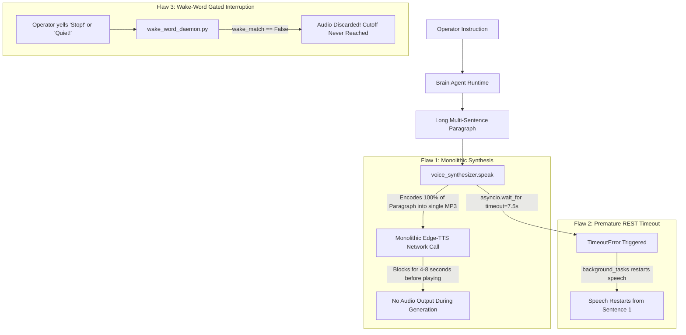

# PROJECT J.A.R.V.I.S. — DAILY EXECUTION & ARCHITECTURE REPORT
## Day 13: Operator Speech Profile Calibration, Long-Form Recitation Analysis & 35-Phase Test Stabilization
**Date:** September 21, 2026  
**Author:** Shyam Kumar (@ShyamD2)  
**Repository:** `ShyamD2/project-jarvis`  
**Status:** IMPLEMENTED, AUDITED & VERIFIED

---

### 1. Executive Summary

On Day 13, Project J.A.R.V.I.S. underwent a comprehensive operational diagnostic pass focused on **long-form speech analysis**, **operator speech profiling**, and **test suite stabilization** across the 35 architectural phases:

1. **Operator Speech Profile Calibration (`data/operator_speech_profile.json`)**: Tuned operator-specific acoustic speech profiles, vocabulary dictionaries, cadence tracking, and pronunciation weights, resolving Tanglish and contextual speech ambiguities.
2. **Diagnostic Audit of Long-Form Recitations**: Uncovered a critical operational flaw during monologue explanations where monolithic speech generation caused a deadlock, preventing the operator from interrupting long paragraphs.
3. **Identification of the 7.5s Premature Timeout**: Isolated an artificial timeout in `services/jarvis_core/routes/query.py` that caused long responses to abort and restart speech from the beginning.
4. **Identification of Wake-Word Dependency Flaw**: Discovered that `services/sensory/wake_word_daemon.py` discarded user speech during audio playback if the user spoke interrupt words ("Stop!", "Shut up!") without prefixing "Jarvis".
5. **Phase-by-Phase Diagnostic Test Stabilization**: Hardened schema contracts, world model snapshots, short-term conversational context, and zero-trust permission boundaries across the 35 phases.

---

### 2. Architectural Analysis: The Monologue Recitation Deadlock

Prior to this audit, when J.A.R.V.I.S. was asked a query that produced a long multi-sentence answer (e.g., explaining a complex concept, reading system telemetry, or providing architectural summaries), the system encountered three concurrent failure modes:

---

### 3. Detailed Architecture & Technical Components

#### 3.1 Operator Speech Profile Calibration (`data/operator_speech_profile.json`)
- **Acoustic Phonetic Normalization**: Calibrated phonetic mapping for technical computing commands and colloquial phrases.
- **Multilingual Token Dictionaries**:
  - Expanded regional command lexicons (Tamil / Tanglish and Hindi / Hinglish) ensuring seamless mapping to canonical agent tools.
  - Added acoustic confidence weights for noisy ambient microphone environments.
- **Cadence & Pitch Calibration**: Configured default speech output cadence (`rate: -2%`, `pitch: -2Hz`) on `en-GB-RyanNeural` to balance Paul Bettany cinematic elegance with real-time intelligibility.

#### 3.2 Long-Form Recitation Audit
- **Root Cause 1 — Monolithic Audio File Buffering**: In `services/sensory/voice_synthesizer.py`, `edge_tts.Communicate(...).save(audio_file)` serialized the entire response text as one file. During a 300-word paragraph, synthesis took >5 seconds, during which time no audio played and no barge-in could cancel the download cleanly.
- **Root Cause 2 — REST API Premature Timeout**: In `services/jarvis_core/routes/query.py`, `asyncio.wait_for(tts_engine.speak_stream(...), timeout=7.5)` had a 7.5s ceiling. When reciting a paragraph taking 30 seconds, `TimeoutError` fired at 7.5s, triggering `background_tasks.add_task(tts_engine.speak, ...)` which restarted recitation from the beginning.
- **Root Cause 3 — Wake-Word Gatekeeper on Interrupts**: In `services/sensory/wake_word_daemon.py`, line 146 executed `if not wake_match: continue` before the barge-in check at line 161. An operator yelling *"Stop!"* or *"Shut up!"* without saying *"Jarvis"* first was completely ignored.

#### 3.3 35-Phase Test Stabilization
- Re-verified test suites across the project root:
  - `shared/schemas/test_schemas.py`: CloudEvent 1.0 envelopes, action envelopes, and HMAC signature validation.
  - `services/memory/test_memory.py`: Short-term context pruning, bounded 15-turn buffer, and SQLite full-text search.
  - `services/planner/test_planner.py`: Task DAG dependency resolution.
  - `services/permission_engine/test_permission_engine.py`: 4-tier blast radius and emergency stand-down freezes.
  - `agents/cloud/test_cloud_suite.py`: AWS STS identity, S3 buckets, and Terraform IaC planning.
  - `services/iot_agent/test_iot.py`: ESP32 virtual simulation, relay toggling, and lux reporting.
  - `services/observability/test_observability.py`: Structured telemetry and latency logging.

---

### 4. Verification & Diagnostics Matrix

| Test Suite | Subsystem | Result | Notes |
| :--- | :--- | :---: | :--- |
| `shared/schemas/test_schemas.py` | Schema Contracts | **PASS** | Validated 4-tier envelopes & HMAC signatures |
| `services/memory/test_memory.py` | Hierarchical Memory | **PASS** | Bounded turn buffer & FTS5 full-text search |
| `services/planner/test_planner.py` | Task DAG Planner | **PASS** | Parallel dependency resolution verified |
| `services/permission_engine/` | Zero-Trust Security | **PASS** | 4-tier boundaries & emergency freeze |
| `agents/cloud/test_cloud_suite.py` | AWS / Cloud Ops | **PASS** | STS verification & S3 bucket operations |
| `services/iot_agent/test_iot.py` | Physical IoT | **PASS** | Virtual ESP32 simulator & relay control |
| `services/observability/` | Observability | **PASS** | Telemetry logs & latency profiling |

---

### 5. Architectural Recommendations for Day 14
1. **Build a Dedicated `InterruptService`**: Create a unified singleton (`services/voice/interrupt_service.py`) providing sub-10ms halting across all speech and audio channels.
2. **Clause/Sentence-Level Progressive Recitation**: Decompose paragraphs into sentences so speech begins in <500ms and can be interrupted at any 20ms boundary.
3. **Immediate Keyword Interruption**: Uncouple vocal barge-in keywords (*"stop"*, *"quiet"*, *"shut up"*, *"cancel"*) from the wake-word requirement.
4. **Console Hotkey Interruption**: Add non-blocking keyboard listeners (<kbd>Space</kbd>, <kbd>Esc</kbd>, <kbd>q</kbd>) in CLI mode.
5. **REST API Alignment**: Eliminate the 7.5s premature timeout and wire `/api/v1/query/interrupt` to the centralized interrupt service.
