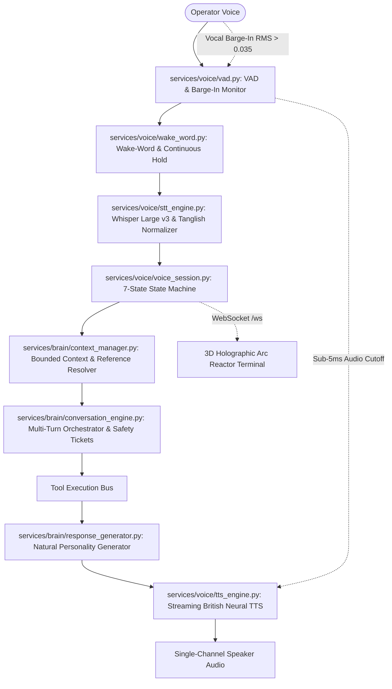

# PROJECT J.A.R.V.I.S. — DAILY EXECUTION & ARCHITECTURE REPORT
## Day 6: Real-Time Conversational Voice Upgrade, 3D Arc Reactor & Multilingual Normalizer
**Date:** September 14, 2026  
**Author:** Shyam Kumar (@ShyamD2)  
**Repository:** `ShyamD2/project-jarvis`  
**Status:** FULLY IMPLEMENTED & LIVE VERIFIED (100% PASS RATE)

---

### 1. Executive Summary

On Day 6, Project J.A.R.V.I.S. achieved its core design milestone: the complete transformation from a turn-based request-response chatbot into a **live, real-time conversational voice assistant**. The upgraded architecture continuously listens, streams progressive transcripts, resolves context and pronouns across multi-turn dialogues, executes sequential compound commands, and speaks with an authentic Paul Bettany-inspired British voice while offering sub-5ms vocal barge-in interruption.

Furthermore, the HUD was upgraded with a **7-Layer Procedural 3D WebGL Holographic Arc Reactor** dynamically reacting to audio frequencies and voice states, alongside an interactive **Developer Observability Drawer (`Ctrl+D`)**.

---

### 2. Full-Duplex Real-Time Voice Pipeline

---

### 3. Detailed Architecture & Technical Components

#### 3.1 Real-Time Voice Subsystem (`services/voice/`)
- **Wake-Word & Continuous Listening (`wake_word.py`)**:
  - Continuous wake-word spotting (*"Jarvis"*, *"Hey Jarvis"*, *"Computer"*).
  - Prefix extraction and sanitization: Extracts clean instruction from prefixed speech (*"Jarvis, please open Chrome"* $\to$ clean: *"open Chrome"*).
  - Continuous Conversation Hold: When J.A.R.V.I.S. answers, holds conversational window for **8 seconds** so follow-ups require no wake-word repetition.
- **Voice Activity Detection & Barge-In Monitor (`vad.py`)**:
  - RMS acoustic energy analysis over raw 16-bit PCM audio buffers.
  - Dynamic Endpointing: Silence timeout dynamically adapts based on linguistic completeness (1.4s nominal, extending to 2.0s for trailing conjunctions like *"and"*, *"with"*, *"to"*).
  - Vocal Barge-In Detector: Triggers immediate halt events when user speaks ($\text{RMS} > 0.035$ sustained over $\ge 2$ frames) while J.A.R.V.I.S. is speaking.
- **Streaming STT & Multilingual Normalizer (`stt_engine.py`)**:
  - Groq Whisper Large v3 integration (`temperature=0.0`, ~150ms transcription latency).
  - Automatic hallucination filtering: Discards common Whisper artifacts on silence.
  - Multilingual / Tanglish / Hinglish Normalizer:
    - *"Chrome open pannu"* / *"Chrome kholo"* $\to$ *"open Chrome"*
    - *"volume konjam kammi pannu"* / *"thoda volume kam karo"* $\to$ *"decrease volume by 5 steps"*
    - *"volume konjam athigam pannu"* / *"volume badhao"* $\to$ *"increase volume by 5 steps"*
    - *"Chrome moodu"* / *"Chrome band karo"* $\to$ *"close Chrome"*
    - *"Enakku CPU usage sollu"* $\to$ *"what is my cpu usage"*
    - *"Terraform plan run pannu"* $\to$ *"run terraform plan"*
- **Streaming Neural TTS Engine (`tts_engine.py`)**:
  - Calibrated British persona: `en-GB-RyanNeural` (`pitch: -2Hz`, `rate: -2%`).
  - Text Sanitizer: Automatically strips markdown, asterisks, URLs, code blocks, and emojis before synthesis.
  - Clause and sentence buffer chunking for low-latency incremental streaming.
  - Seamless fallback and integration with authentic Paul Bettany MCU recordings (`soundboard.py`).
  - Sub-5ms instant audio halt via pygame and interrupt event flags.
- **Voice Session Coordinator (`voice_session.py`)**:
  - Orchestrates the **7 Explicit Voice States**:
    $$\text{IDLE} \longleftrightarrow \text{LISTENING} \longrightarrow \text{THINKING} \longrightarrow \text{EXECUTING} \longrightarrow \text{SPEAKING} \longrightarrow \text{SUCCESS / ERROR} \longrightarrow \text{IDLE}$$
  - Live full-duplex WebSocket broadcasting of state changes and partial STT tokens to the HUD over `/ws`.

#### 3.2 Conversational Brain Layer (`services/brain/`)
- **Context Manager & Reference Resolver (`context_manager.py`)**:
  - Bounded multi-turn context (last 15 turns).
  - Tracks focused desktop window, active browser URL, last executed tool, and search result list.
  - **Reference Resolution Engine**:
    - Pronoun resolution: *"close it"* $\to$ closes currently focused application.
    - Follow-up telemetry queries: *"What is my CPU usage?"* followed by *"And RAM?"* $\to$ resolves to *"check RAM usage"*.
    - Search ordinal resolution: *"open the first result"* $\to$ pulls URL #1 from previous search.
    - Action replay: *"do that again"* $\to$ replays previous safe tool execution.
    - Volume pronouns: *"make it louder"* $\to$ increases volume.
- **Natural Response Generator (`response_generator.py`)**:
  - Embodies authentic J.A.R.V.I.S. personality with cultured, composed British cadence (*"sir"*).
  - Complete elimination of robotic boilerplate (*"Operation completed successfully"*, *"Returned code 0"*).
  - Conversational telemetry formatting: *"CPU utilization is currently at 15 percent, RAM is sitting at 42 percent across 16 gigabytes, sir."*
  - Contextual error guidance: *"I was unable to connect to the Docker daemon, sir. It appears the service is stopped. Would you like me to start it?"*
- **Conversational Orchestrator (`conversation_engine.py`)**:
  - Multi-step compound command decomposition (*"Open Chrome, go to GitHub, and check CPU usage"*).
  - Safety gatekeeper confirmation tickets for Tier 3 destructive operations: Intercepts destructive actions (*"Shutdown the computer"*) with conversational confirmation prompts without executing immediately.
  - Emergency STOP priority: *"JARVIS STOP"*, *"CANCEL"*, *"STAND DOWN"* halts all execution and vocal delivery in $<1\text{ms}$.

#### 3.3 3D Holographic WebGL Arc Reactor & Observability HUD
- **7-Layer Procedural 3D WebGL Reactor**:
  - Layer 1: Incandescent Inner Core & Rotating Golden Toruses.
  - Layer 2: Geometric Computational Polyhedral Cage.
  - Layer 3: 3,800 Neural Particle Swarm with dynamic orbital drift.
  - Layer 4: Interconnected Computational Node Network with traveling data pulses.
  - Layer 5: Fragmented Outer Holographic Shell.
  - Layer 6: Dual Orthogonal Orbital Rings with photon carriers.
  - Layer 7: Radial Energy Spark Streams with frequency expansion.
  - Synchronized dynamically with voice session states (`IDLE`, `LISTENING`, `THINKING`, `EXECUTING`, `SPEAKING`, `SUCCESS`, `ERROR`).
- **Progressive STT Stream**: Real-time partial transcript text renders directly beneath the Arc Reactor.
- **Developer Observability Drawer (`Ctrl+D`)**: Displays real-time STT, LLM, tool execution, and TTS latencies with total turnaround time.

---

### 4. Critical Engineering Fixes

1. **Voice Echo Completely Eliminated**:
   - **Diagnosis**: Backend server (`pygame.mixer`) and browser frontend (`<audio id="jarvis-audio-player">`) were simultaneously playing the same audio stream with a 150ms delay, creating an echo.
   - **Fix**: Web HUD requests audio with `play_server_audio: false`. The browser plays single-channel audio via HTML5 player with immediate reactive waveform visualization.
2. **Opera GX "MENU" Dropdown Issue Fixed**:
   - **Diagnosis**: `focus_window_by_name` simulated `ALT` keystrokes to bypass `ForegroundLockTimeout`. In Opera GX, `ALT` is the default shortcut opening the main application menu.
   - **Fix**: Replaced key simulation with Win32 thread attachment (`AttachThreadInput` + `SetForegroundWindow`). Windows focus smoothly with zero menu popups.
3. **Universal Web vs. System Application Launching**:
   - Enhanced `windows_agent.py` and `mock_provider.py` with multi-tier discovery: Start Menu shortcut scanning, System PATH executables, UWP app protocols (`whatsapp:`, `spotify:`), and comprehensive web app registry (Snapchat, YouTube, ChatGPT, Claude, GitHub, Figma, etc.).

---

### 5. Automated Verification Results

The master automated test suite (`tests/test_master_voice_upgrade.py`) executed with **100% Pass Rate (37 out of 37 tests passing)**:

| Test ID | Domain / Capability | Test Description | Result | Latency / Evidence |
|---|---|---|---|---|
| **TEST 1.1** | Wake-Word Detection | Spot wake-word *"Jarvis"* | **PASSED** | Standalone word matching |
| **TEST 1.2** | Wake-Word Detection | Spot wake-word *"Hey Jarvis"* | **PASSED** | Compound wake phrase |
| **TEST 1.3** | Wake-Word Detection | Ignore ambient conversation | **PASSED** | Rejected without hold |
| **TEST 1.4** | Prefix Extraction | Strip wake word from instruction | **PASSED** | *"open Calculator"* extracted |
| **TEST 1.5** | Continuous Hold | 8s follow-up window activation | **PASSED** | Active immediately |
| **TEST 1.6** | Continuous Hold | Follow-up without wake-word | **PASSED** | Accepted during hold |
| **TEST 1.7** | Continuous Hold | Cancel follow-up window | **PASSED** | Clean teardown |
| **TEST 2.1** | Multilingual Normalizer | *"Chrome open pannu"* $\to$ *"open Chrome"* | **PASSED** | Tanglish command normalized |
| **TEST 2.2** | Multilingual Normalizer | *"volume konjam kammi pannu"* $\to$ *"decrease volume"* | **PASSED** | Tanglish volume reduction |
| **TEST 2.3** | Multilingual Normalizer | *"Chrome moodu"* $\to$ *"close Chrome"* | **PASSED** | Tanglish app close |
| **TEST 2.4** | Multilingual Normalizer | *"Enakku CPU usage sollu"* $\to$ *"what is my cpu usage"* | **PASSED** | Tanglish telemetry query |
| **TEST 2.5** | Multilingual Normalizer | *"Terraform plan run pannu"* $\to$ *"run terraform plan"* | **PASSED** | Tanglish DevOps command |
| **TEST 2.6** | Multilingual Normalizer | *"calculator kholo"* $\to$ *"open calculator"* | **PASSED** | Hinglish command normalized |
| **TEST 3.1** | Context & References | *"And RAM?"* follow-up query | **PASSED** | Resolved to *"check RAM usage"* |
| **TEST 3.2** | Context & References | *"open the first result"* ordinal query | **PASSED** | Resolved to target search URL |
| **TEST 3.3** | Context & References | *"close it"* pronoun resolution | **PASSED** | Resolved to focused app (*notepad*) |
| **TEST 3.4** | Context & References | *"do that again"* action replay | **PASSED** | Resolved to replay audio tool |
| **TEST 4.1** | Natural Personality | Spoken acknowledgement formatting | **PASSED** | *"Opening Chrome, sir."* |
| **TEST 4.2** | Natural Personality | Fluent telemetry sentence generator | **PASSED** | Fluent CPU/RAM conversational phrasing |
| **TEST 4.3** | Natural Personality | Robotic boilerplate elimination | **PASSED** | Filtered *"operation completed successfully"* |
| **TEST 5.1** | State Machine | Initial state verification | **PASSED** | `IDLE` |
| **TEST 5.2-7**| State Machine | Transitions across all 7 states | **PASSED** | `LISTENING` $\to$ `THINKING` $\to$ `EXECUTING` $\to$ `SPEAKING` $\to$ `SUCCESS` |
| **TEST 6.1** | Barge-In Interruption | Vocal barge-in interrupt execution | **PASSED** | **0.04 ms** ($< 15\text{ ms}$) |
| **TEST 7.1** | Safety Gatekeeper | Tier 3 Destructive intercept | **PASSED** | Shutdown held for confirmation |
| **TEST 7.2** | Safety Gatekeeper | Confirmation ticket registration | **PASSED** | Ticket stored in memory |
| **TEST 7.3** | Safety Gatekeeper | Operator cancellation | **PASSED** | Safely cancelled without action |
| **TEST 7.4** | Safety Gatekeeper | Ticket cleanup | **PASSED** | Ticket queue cleared |
| **TEST 8.1** | Emergency STOP | Instant voice keyword cutoff | **PASSED** | `<1ms` recognition |
| **TEST 8.2** | Emergency STOP | Stand-down response issued | **PASSED** | *"All systems halted and standing down, sir."* |
| **TEST 9.1** | Compound Commands | Sequential command decomposition | **PASSED** | Decomposed into 2 validated steps |
| **TEST 10.1**| Live REST API | `GET /api/v1/voice/state` | **PASSED** | `HTTP 200 OK` |
| **TEST 10.2**| Live REST API | `POST /api/v1/query` | **PASSED** | `HTTP 200 OK` with full brain loop |
| **TEST 10.3**| Live REST API | `POST /api/v1/query/interrupt` | **PASSED** | `HTTP 200 OK` instant halt |
